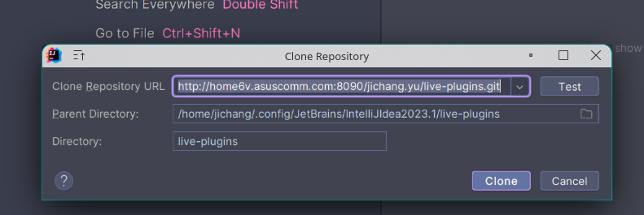

# san-live-plugins
For intellij: 

Custom plugin for [LivePlugins](https://github.com/dkandalov/live-plugin)

## Use
### 1.安装 Live Plugins

 

### 2.打开插件窗口

#### 2.1 从 Tool Window 打开
 

#### 2.2 从 Action 窗口搜索打开

### 3.新建或者导入插件
#### 3.1 导入
  
  
这里窗口会提示 LivePlugins 的插件路径，clone 的 git 仓库也会在这下面。  
所以使用本仓库的时候，需要手动把需要的插件复制到 Parent Directory 路径。  
比如使用 EasyCode：  

#### 4 打开自动运行

live-plugins 是 git 仓库，不是一个标准的插件，所以这个里运行会失败，不需要的时候可以从 Parent Directory 删掉

## NOTE
升级 IDEA 大版本的时候。 Parent Directory 会发生变化，所以可以手动从旧的目录复制过去